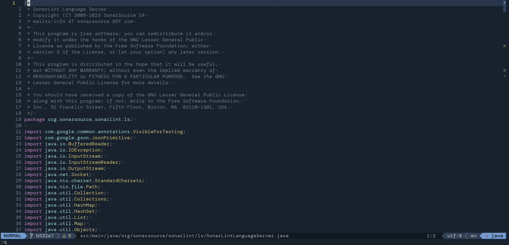

<script src="https://liberapay.com/schrieveslaach/widgets/button.js"></script>

<noscript><a href="https://liberapay.com/schrieveslaach/donate"></a></noscript>

# sonarlint.nvim

Extensions for the built-in [Language Server Protocol][1] support in
[Neovim][2] (>= 0.8.0) for [sonarlint-language-server][3] (>= 2.16.0.65434).



# Required Third Party Plugins:

For Java projects [`nvim-jdtls`][nvim-jdtls] is required to resolve classpath
configurations that is then required to configure sonarlint-language-server as
expected.

For certain features, e.g. Connected Mode, sonarlint-language-server needs to
gather information about source code management (SCM). Therefore,
sonarlint.nvim gathers these information via [gitsgins][gitsigns] plugin. If
there is no gitsigns installed, sonarlint.nvim assumes that there is no SCM
provider.

# Warning :warning:

This repository is work in progress and the API is likely to change.

# Install sonarlint-ls

## Manual installation

You can install the sonarlint-ls by extracting it from the [sonarlint-vscode plugin](https://github.com/SonarSource/sonarlint-vscode). Head over to the [releases](https://github.com/SonarSource/sonarlint-vscode/releases) and download the latest `*.vsix` file. As it is a ZIP file, it contains the `sonarlint-ls.jar` and all available analyzers. Extract these JAR files from the `extension/server/` and `extension/analyzers/`, and configure `sonarlint.nvim` according to the [setup section](#setup).

## mason.nvim

If you are using [`mason.nvim`](https://github.com/williamboman/mason.nvim) you can simply do `:MasonInstall sonarlint-language-server`. See below for setup instructions when using this method.

# <a name="setup"></a>Setup

:warning: Make sure that you configure sonarlint.nvim after [lspconfig](https://github.com/neovim/nvim-lspconfig).

```lua
local lspconfig = require('lspconfig')

-- do stuff with lspconfig

require('sonarlint').setup({
   -- …
})
```

## For manual installation

```lua
require('sonarlint').setup({
   server = {
      cmd = {
         'java', '-jar', 'sonarlint-language-server-VERSION.jar',
         -- Ensure that sonarlint-language-server uses stdio channel
         '-stdio',
         '-analyzers', 'path/to/analyzer1.jar', 'path/to/analyzer2.jar', 'path/to/analyzer3.jar',
      },
   },
   filetypes = {
      -- Tested and working
      'python',
      'cpp',
      'java',
   }
})
```

## For installation via mason.nvim

```lua
require('sonarlint').setup({
   server = {
      cmd = {
         'sonarlint-language-server',
         -- Ensure that sonarlint-language-server uses stdio channel
         '-stdio',
         '-analyzers',
         -- paths to the analyzers you need, using those for python and java in this example
         vim.fn.expand("$MASON/share/sonarlint-analyzers/sonarpython.jar"),
         vim.fn.expand("$MASON/share/sonarlint-analyzers/sonarcfamily.jar"),
         vim.fn.expand("$MASON/share/sonarlint-analyzers/sonarjava.jar"),
      }
   },
   filetypes = {
      -- Tested and working
      'python',
      'cpp',
      'java',
   }
})
```

# Settings

## Compilation Database

Analyzing C/C++ projects it is required to provide a [Compilation Database
file][Compilation-Database] (see alse [here][SonarSource-Compilation-Database].
Therefore, sonarlint.nvim tries to find the [Compilation
Database][Compilation-Database] automatically within your workspace. If that
doesn't work, you can provide it manually.

```lua
require('sonarlint').setup({
   server = {
      cmd = {
         -- …
      },
      settings = {
         sonarlint = {
            pathToCompileCommands = "insert your path here"
         }
      }
   },
})
```

## Rules

Rules can be configured, e.g. by turning them on or off, with following
configuration.

```lua
require('sonarlint').setup({
   server = {
      cmd = {
         -- …
      },
      settings = {
         sonarlint = {
            rules = {
               ['typescript:S101'] = { level = 'on', parameters = { format = '^[A-Z][a-zA-Z0-9]*$' } },
               ['typescript:S103'] = { level = 'on', parameters = { maximumLineLength = 180 } },
               ['typescript:S106'] = { level = 'on' },
               ['typescript:S107'] = { level = 'on', parameters = { maximumFunctionParameters = 7 } }
            }
         }
      }
   },
})
```

[1]: https://microsoft.github.io/language-server-protocol/
[2]: https://neovim.io/
[3]: https://github.com/SonarSource/sonarlint-language-server
[nvim-jdtls]: https://github.com/mfussenegger/nvim-jdtls
[gitsgins]: https://github.com/lewis6991/gitsigns.nvim
[SonarSource-Compilation-Database]: https://www.sonarsource.com/blog/alternative-way-to-configure-c-and-cpp-analysis/
[Compilation-Database]: https://clang.llvm.org/docs/JSONCompilationDatabase.html
